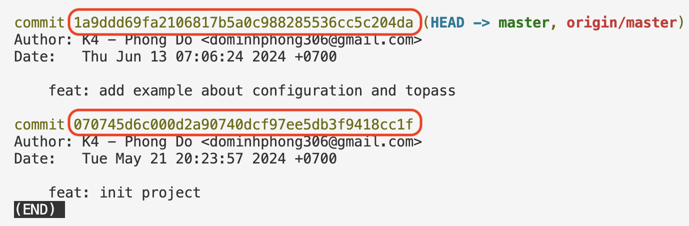

# Key takeaway
Tại repo `pw-course`, tạo folder `lesson-3`. Thêm vào đó file `key-takeaways.md`, liệt kê các kiến thức mà bạn học được trong buổi 3

# Git
## Kiến thức bổ sung: checkout về một revision bất kì
Trong bài học, khi dùng câu lệnh `git log`, ta thấy được danh sách các commit như sau:

Trong đó, phần được khoanh đỏ trong hình được gọi là `commit hash` hay `revision`. Để trở về revision (hay hiểu đơn giản là đi về thời điểm quá khứ để xem lúc ấy code của mình có gì), ta dùng lệnh `git checkout <revision>`  
Ví dụ:
`git checkout 070745d6c000d2a90740dcf97ee5db3f9418cc1f`

# Bài tập 
1. Hãy tạo file `lesson-03/01-lythuyet-git.txt` để trả lời cho các câu hỏi dưới đây:
Giải thích các câu lệnh:    
`git commit --amend`    
`git commit --amend "<message>"`    
`git restore --staged <file>`    
`git reset HEAD~1`    

2. Hãy tạo file lesson-03/02-thuc-hanh-git.txt để ghi đáp án cho câu hỏi sau  
    Giả sử có 1 folder demo mới được tạo. Hãy liệt kê các file theo từng vùng.
    Liệt kê các commit và message tương ứng sau khi thao tác 1 loại các lệnh sau( sẽ rất tuyệt vời nếu bạn không chạy trên máy tính thật, mà bạn chạy trong đầu, sẽ giúp bạn hiểu về Git rõ ràng hơn):
    Trình bày theo format liệt kê rõ từng bước, mỗi bước thì các vùng có file nào. Việc này sẽ giúp mentor chấm bài kĩ hơn và kiểm tra rằng bạn hiểu đúng

