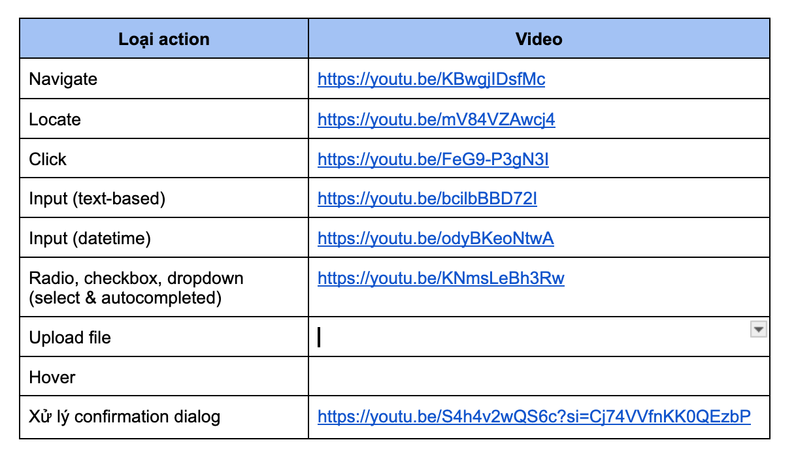
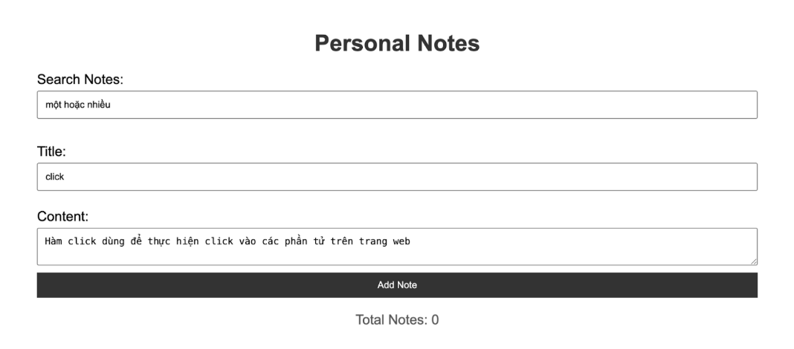
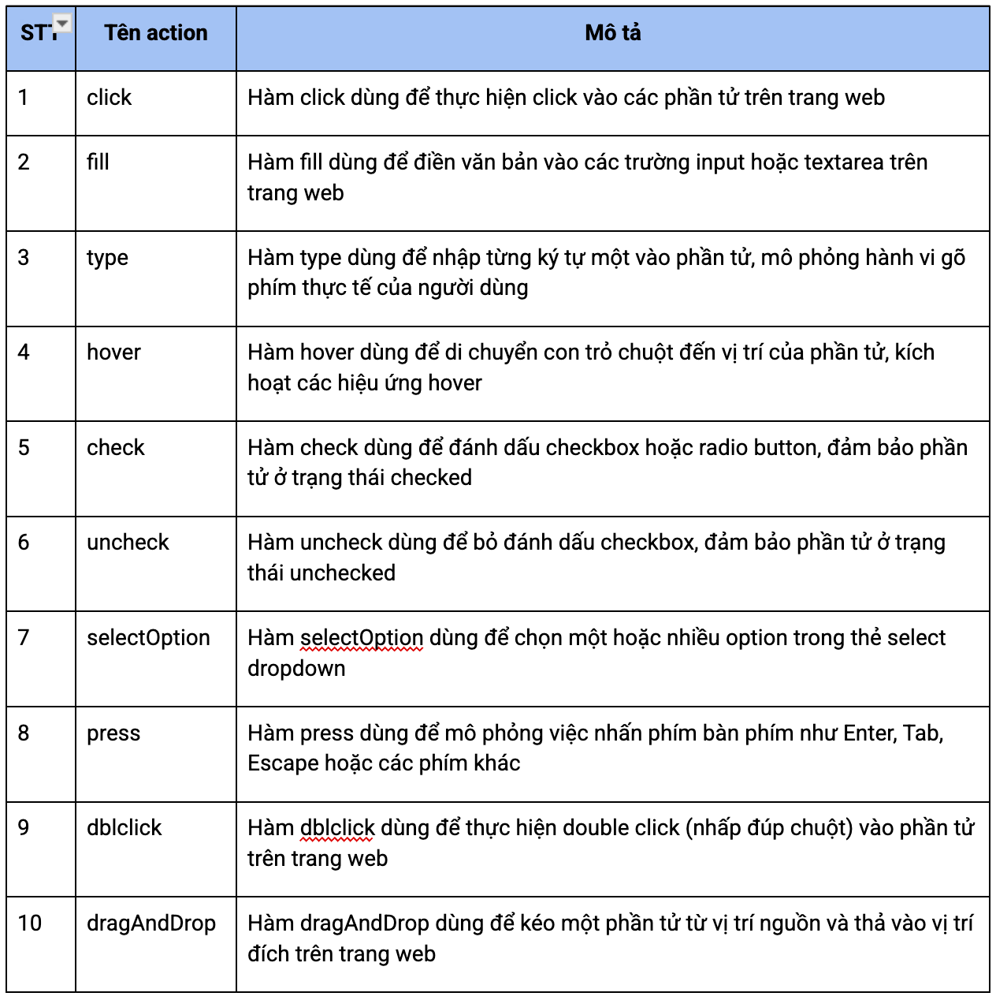

# Tổng hợp kiến thức
Tạo file 00-key-takeaways.md, tổng hợp lại các kiến thức được học trong bài. Push lên GitHub.
# DOM & selector
Kiến thức bổ sung: DOM table
Xem video: https://youtu.be/7CvtILyQ_3M 
Kiến thức bổ sung để làm bài: hàm text()
Hàm text()dùng để tìm ra phần tử có text tương ứng. Ví dụ
Với DOM sau:

This is a text

Để chọn phần tử này, ta dùng cú pháp như sau:
//div[text()=’This is a text’]
Giải thích: Chọn phần tử div mà có text là This is a text
Kiến thức bổ sung để làm bài: hàm contains()
Đôi khi trong phần tử HTML, phần tử sẽ bị thừa khoảng trắng, hoặc có các giá trị không cố định trong text. Ví dụ

 Tôi là Alex 
 // Text này có 1 ký tự space ở đầu và ở đuôi

 Bây giờ là: 08:07 
 // Thời gian sẽ tuỳ vào thời điểm truy cập trang web

Để chọn các phần tử này, ta dùng hàm contains(text(), <giá trị cố định>). Ví dụ:
//div[contains(text(), ‘Tôi là Alex’)]
Giải thích: chọn thẻ div, có text chứa cụm từ “Tôi là Alex” - đoạn text có bị thừa space ở đầu và ở cuối, selector vẫn tìm được bình thường.

//div[contains(text(), ‘Bây giờ là:’)]

Giải thích: chọn thẻ div, có chứa cụm từ “Bây giờ là” - đoạn thời gian phía sau có thay đổi thì selector vẫn tìm được bình thường.
## Bài tập
Cho DOM sau: https://gist.github.com/minhphong306/6f00adc60f45c898e26d55bcb6cc0ae9 
Tạo file 01-xpath.txt, đưa ra câu trả lời cho các câu hỏi sau
Sử dụng xpath tuyệt đối, chọn phần tử sau:
Lấy input "Họ và tên"
Lấy button "Đăng ký"
Lấy hàng đầu tiên trong tbody
Sử dụng xpath tương đối, chọn phần tử sau:
Lấy input có placeholder="Số điện thoại"
Lấy email của "Trần Thị Bình" (hàng 2, cột 2)
Lấy số điện thoại của "Lê Hoàng Cường" (hàng 3, cột 3)
Lấy button có class="btn-register"
Lấy table có id="resultTable"

# Playwright
Kiến thức bổ sung: các action và các option

## Bài tập
Tại repo pw-course đã tạo từ bài trước, tạo folder tests/lesson-05 để chứa code cho các bài tập dưới đây
Tạo file test1.spec.ts. Truy cập trang https://material.playwrightvn.com/, click vào “Bài học 1: Register Page (có đủ các element)”
Nhập thông tin cho các field: Username, Email, Gender, Hobbies, Interests, Country, Date of Birth, Profile Picture, Biography
Click button Register
Tạo file test2.spec.ts. Truy cập trang https://material.playwrightvn.com/, click vào “Bài học 2: Product page”, hãy thêm sản phẩm để giỏ hàng có số lượng sản phẩm như sau:
Sản phẩm 1: 2 sản phẩm
Sản phẩm 2: 3 sản phẩm
Sản phẩm 3: 1 sản phẩm
Tạo file test3.spec.ts. Truy cập trang https://material.playwrightvn.com/, click vào “Bài học 3: Todo page”. 
Thêm mới 100 todo item có nội dung “Todo <i>”
Xoá các todo có số lẻ
Tạo file test4.spec.ts. Truy cập trang https://material.playwrightvn.com/, click vào “Bài học 4: Personal notes”.
Thêm mới 10 note với nội dung sau ở bảng dưới đây.
Field “Title”: điền nội dung ở cột “Tên action”
Field “Content”: điền nội dung ở cột “Mô tả”
Thực hiện search với keyword “một hoặc nhiều”

