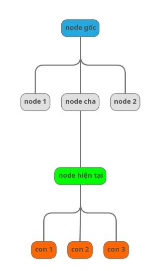

# DOM - relation
## Quy ước 
- Node gốc
- Node hiện tại
- Node cần chú ý


## Ví dụ dom
File 

## Relation
- cú pháp: node hiện tại / relation :: * hoặc tên node

### self
- node hiện tại
- vd:
```
//h3[text()='Dell XPS 13']/self::h3
```

### parent
- cha
- Là node *phía trên trực tiếp* của node hiện tại 
- vd
```
//h3[text()='Dell XPS 13']/parent::*
hoặc
//h3[text()='Dell XPS 13']/parent::div
```

### chidren
- con
- Là node phía dưới trực tiếp (con) của node hiện tại
- vd:
```
//div[@class='product active']/child::*
//div[@class='product active']/child::span
```

### ancestor
- Tổ tiên
- Là các node cha, ông , cụ, .. tương tự gia phả (có bao gồm cả thẻ gốc html)
- vd
```
//div[@class='product active']/ancestor::*
//div[@class='product active']/ancestor::div
```

### descendant
- hậu duệ
- là các node con, cháu, chắt,..
- vd
```
//div[@class='item-list']/descendant::*
```

### sibling
- anh em
- là những phần tử cùng cấp và cùng cha
- vd
```
//div[@class='item-list']/../*
ra kết quả là chính thẻ div hiện tại và các thẻ anh em
```

### following
- theo sau
- gồm các node ở phí bên tai phải của node hiện tại (bao gồm các node con của node theo sau, trừ con của node hiện tại)
```
//div[@class='item-list']/following::*
//div[@class='product active']/following::*
```

### preceding
- phía trước
- gồm các node ở phía bên tay trái của node hiện tại - trừ các node tổ tiên

```
//div[@class='item-list']/preceding::*
```

### following-sibling
- anh em phía sau

```
//div[@id='p1']/following-sibling::*
```

### preceding-sibling
- anh em phía trước

```
//div[@id='p1']/preceding-sibling::*
```

# XPath advance methods
## Định nghĩa
Xpath axes methods (phương thức trục xpath) là các phương pháp để **điều hướng** và **chọn các node** trong cây DOM XML hoặc HTML dựa trên **mối quan hệ** giữa các node với nhau.

## Công dụng
- Tìm kiếm elements dựa trên **vị trí tương đối** (parent, child, sibling, ancestor,...)
- **Linh hoạt hơn** trong việc chỉ dùng đường dẫn tuyệt đối hoặc tương đối

## Willcard: *
- Nghĩa là khớp với tất cả
VD:
//div -> khớp thẻ div
//* -> khớp tất cả các loại thẻ

## child - Con trực tiếp
VD:
//form[@id='test-form']/child::button


## descendant - Tất cả con cháu
VD:
//form[@id='test-form']/descendant::*

## parent - Tìm cha
VD:
//button[text()='Create Test Case']/parent::form

## ancestor - Tìm tổ tiên
VD:
//button[@class='btn-edit']/ancestor::table

## following-sibling - Anh em phía sau
//label[@for='testName']/following-sibling::input

## preceding-sibling - Anh em đứng trước
//button[@class='btn-reset']/preceding-sibling::button

## following - Tất cả node sau trong document
//h2[text()='Test Cases List']/following::button[@class='btn-run']

## ancestor-or-self - Tổ tiên hoặc chính nó
- Tìm tất cả span status trong table (bao gồm cả chính nó nếu là span)
//table[@id='test-table']/ancestor-or-self::span[contains(@class, 'status')]

## preceding - Tất cả node trước trong document
- Từ h2 "Test Execution Results", tìm tất cả td có text "High" phía trước
//h2[text()='Test Execution Results']/preceding::td[@class='priority-high']

## descendant-or-self - Con cháu hoặc chính nó
- Tìm tất cả span status trong table (bao gồm cả chính nó nếu là span)
//table[@id='test-table']/descendant-or-self::span[contains(@class, 'status')]

# XPath: axes
- parent
- child
- ancestor
- descendant
- following
- preceding
- following-sibling
- preceding-sibling


//tag/relationship::tagname[@attr=’value’]

# XPath advance
## Chứa thuộc tính: @attribute
- sử dụng @ để truy cập thuộc tính của element
- //tagname[@attribute='value']

## AND - Tất cả điều kiện phải đúng
//element[@condition1 and @condition2]

## OR - Một trong các điều kiện đúng
//element[@condition1 or @condition2]

## Lấy text bên trong element
text() lấy text node trực tiếp của element.
//element[text()='exact text']

## normalize-space(): Chuẩn hóa khoảng trắng
Loại bổ khoảng trắng thừa ở đầu, cuối và giữa text.
normalize-space(string)

## contains(): Kiểm tra chứa chuỗi con
Tìm element có chứa một phần text, không cần khớp chính xác.
//element[contains(@attribute, 'substring')]
//element[contains(text(), 'substring')]
